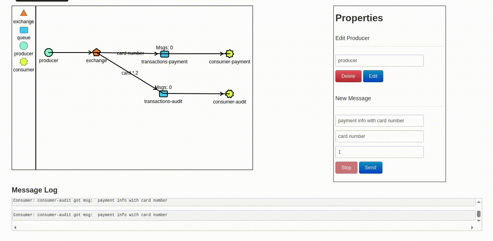

# Events

Events represents a fact or state change in context of system. (Something has happened)

Whenever events happen, you can handle it accordingly.

Example:

```
(Event)
- Insert new User;
  (Handlers)
  - Send an Email;
  - Publish a message to a queue;
  - Notify a user in slack;
  - Insert this User into Salesforce.
```

# How to implement an Event System

```
1st component => Event(Get datas)

2nd component => Operations executed when Event is called

3rd component => Event/Operation Manager
  - Register events and operations
  - Dispatch/Fire an event to execute operations
```

# Message Broker - RabbitMQ

Implementation of `Advanced Message Queuing Protocol`.

A message broker acts as a middleman for various services. They can be used to reduce loads and delivery times of web application servers by delegating tasks that would normally take up a lot of time or resources to a third party that has no other job.
Cited from -> [About RabbitMQ](https://www.cloudamqp.com/blog/part1-rabbitmq-for-beginners-what-is-rabbitmq.html)

Components of Message Broker

- Producer
  - Sends data to share with other services
- Exchange
  - Router to send data to Queue, according to binding key
- Queue
  - Queues data sent from Producer and Exchange
- Consumer
  - Final destination to receive data


