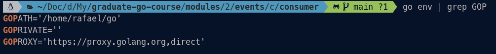
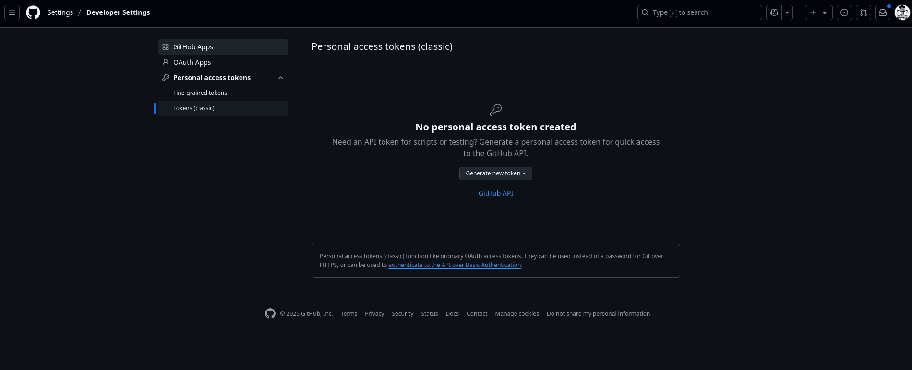

# GOPRIVATE

If you want to use a private repository as an imported library in your project, Golang lets you use GOPRIVATE environment variable to configure remote private repository.

## Set GORPIVATE environment

```
export GOPRIVATE="insert private repo you want"
```



## Generate access token for https credential



## Create ~/.netrc file with access token

```
machine github.com
login rafaelcamelo31
password <access token>
```

## Optional credential config with SSH

```
nano ~/.gitconfig

[url "ssh://git@github.com/"]
        insteadOf = https://github.com/
```

# Go Proxy and Vendor

Go proxy is basically a mirror for frequently used modules to centralize in one place. This is to prevent scattered unreachable modules and libraries. ([go proxy](https://proxy.golang.org/))

Go mod vendor creates a vendor folder locally, just like node_modules in NodeJs.
