# Go Internals

## Multitask and its Timeline

- Before Multitask - (1940 - 1960)
- Time-Sharing System - (1960 - 1970)
- OS's Multitask - (1980)
- Hyper-Threading - (1990 - 2000)
- Multi-Core - (2000)
- Optimization for Cloud, AI and etc (2010)

## Processes

- An instance of a program in execution
- Components
  - Addressing (part in memory dedicated for a process)
  - Contexts
    - Datas and informations OS saves to manage processes
      - Ex.:Program Counter(PC) or Instruction Pointer(IP)
      - Have the address for next instruction processor will execute
      - Assist in Context Switching

## Process Register

- Area where datas and addresses are saved temporary in CPU to be executed
- Datas
  - Ex.: Arithmetic operations and logics
- Register Address
  - Memory allocation including stack pointers
  - Ex.: When accessing a variable, CPU has a registry of a memory to save its value

## Heap and Stack

[Heap and Stack as memory](https://medium.com/eureka-engineering/understanding-allocations-in-go-stack-heap-memory-9a2631b5035d)

- Heap

  - Dynamic memory allocation at runtime

- Stack

  - Used for storing local variables, function arguments, and return addresses during function calls. (LIFO)

## Status and Flags in Registers

- Gives recent status from operations executed by CPU
- Uses specific bits (flags)
- Ex.:
  - Flag Zero (Z): Result of the operation which returned 0.
  - Flag Signal (S) or Negative(N): Indicates whether the result of operation is positive or negative
  - Flag Overflow: Overcapacity in produced result

## Lifecycle of a process

- Creation

  - UNIX/Linux uses fork() to create new process when a program requests for process execution

- Execution

  - The process is being executed by CPU. Can be "executing" or "ready"

- Waiting/Blocked
  - The process is suspended until external event finishes. Common in I/O, where process waits for disc reading or waits for networkd input
- Termination
  - The process completes it execution or terminated forcefuly
  - Exit: Success after concluding instructions
  - Killed: Interruption by error execution or terminated by other process (such as command "kill")

## Creating Process

- UNIX/Linux

  - fork()
  - Clones current process
  - Creates a child process
  - fork() returns diffent value to the parent process (PID)
  - Parent and child processes are identical. However, the values in memory are copied to the different address, separate and independent


## Managing Process

- Scheduler
  - Decides which processe will be executed
  - Alternate between processes
  - Has several algorithms in attempt to maximize CPU use
  - It selects processes from queue with "ready queue"
  - Allocates CPU: Switch states, Ready to Running
  - Frees CPU: I/O when not needed
- Types of Schedulers
  - Non-preemptive: The process in execution has control on when to free CPU for other process. It has a drawback of one process using CPU exclusively.
  - Preemptive: The OS is capable to interrupt a process in execution and give CPU different process. It operates "fairly". Lots of "Context Switching".

## Threads

[Program vs Process vs Thread](https://bytebytego.com/guides/what-is-the-difference-between-process-and-thread/)

- **Program** is an executable file containing a set of instructions. One program can have multiple processes.
- **Process** is an instance of program in execution. When a program is loaded into the memory and becomes active, the program becomes a process.
- **Thread** is the smallest unit of execution within a process.

## Memory in Threads

- Thread uses less memory than process.
- Each thread has own stack independently and isolated.
- Each thread (OS) uses 2MB. (Golang thread uses 2kb)

## Runtime Architecture

- Scheduler
- Goroutines
- Channels
- Garbage Collector
- Memory Allocation
- Stack Management
- Network Poller
- Reflection

## M:N Threading Model

[Introducing M:N Hybrid Threading in Go: Unveiling the Power of Goroutines](https://medium.com/@rezauditore/introducing-m-n-hybrid-threading-in-go-unveiling-the-power-of-goroutines-8f2bd31abc84)

- User-level vs kernel-level threads
- Allows for a dynamic allocation of M user-level threads (goroutines) to N kernel-level threads.
- Allows flexibility and efficiency to concurrent programming.

## Goroutines

- Functions or methods executed concurrently.
- Threads managed by Go runtime.
- Much cheaper than kernel threads (2kb).
- Easier to create and destroy.
- Has own stack. Shares same address of memory in Go program.

## M:P:G Model

[Revealing Golang’s Secret Sauce: A Deep Dive into Its Internals](https://meetsoni15.medium.com/unveiling-golangs-hidden-internals-discover-the-hidden-mechanics-that-optimize-performance-8f946f784041)


## runtime.GOMAXPROCS()

[GOMAXPROCS](https://go.dev/blog/container-aware-gomaxprocs)

- Go creates a P (Processor) per CPU cores.
- Go tries to create a M (Machine -Threads) for each P.

## Scheduler

[Scheduler Structures](https://go.dev/src/runtime/HACKING)

> The scheduler’s job is to match up a G (the code to execute), an M (where to execute it), and a P (the rights and resources to execute it). When an M stops executing user Go code, for example by entering a system call, it returns its P to the idle P pool. In order to resume executing user Go code, for example on return from a system call, it must acquire a P from the idle pool.

- The scheduler in Go runtime:

  - Manages task
  - Load balancing
  - Manages concurrencies

- Go version >= 1.14 works in preemptive scheduler
  - Which means Go is capable to allocate and deallocate processes depending on the situation


## Memory Management

- Fast access

  - L1 - 64kb
  - L2 - 0.5mb
  - L3 - 8mb
  - Used in CPU as a cache with same chip

- Slow access
  - RAM sticks, DDR - Double Data Rate. Clock can access twice per cicle
  - Connected with memory bus (communication channel between CPU and memory)
  - Memories are referenced in Hexadecimal format

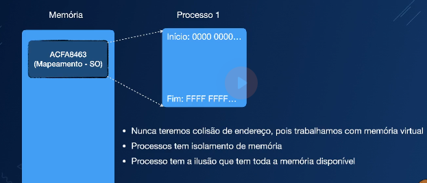

## Memory Access Cost

### Memory management

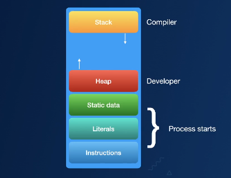

### Stack


### Heap


## Memory Fragmentation

Strategy to avoid ineffienct memory management

- Memory Arenas

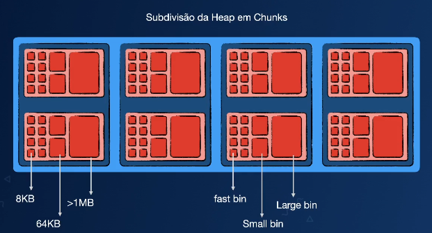

- Memory Allocations

  - malloc(C std library)
  - dlmalloc(Doug Lea's Malloc) - Doesn't support multithreading efficiently
  - ptmalloc/ptmalloc2 (pthreads Malloc) - First memory arenas appearence
  - jemalloc (Jason Evans) - Facebook, Rust, Postgres
  - TCMalloc (Thread-Caching Malloc) - Google

## Memory Allocation in Go

[A visual guide to Go memory allocator](https://medium.com/@ankur_anand/a-visual-guide-to-golang-memory-allocator-from-ground-up-e132258453ed)

- mallocgc

  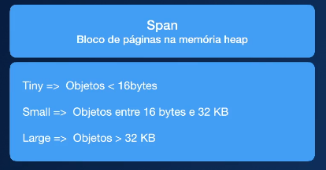
  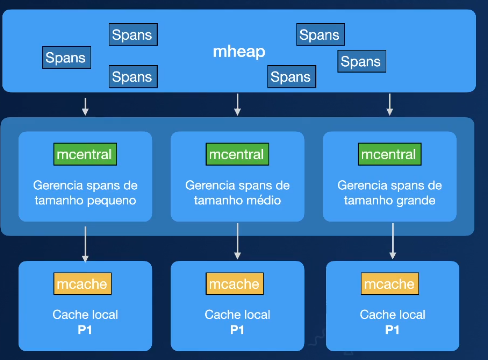

## Grabage Collector in Go

- non-generational and concurrent Tri-Color Mark-and-Sweep algorithm
- The objective of Garbage Collector is to identify and reclaim memory occupied by objects that are no longer reachable or "live"
- Identifies traversing the object graph starting from "root" references (e.g., local variables)
- Iterates through the memory and reclaim the spaces from unreachable objects
- Defragment memory

## Garbage Collector in Action

- Tri-Color
  - White (object unreachable)
  - Gray (object reference marking in process)
  - Black (object is in use, has references)

1. STW (Stop The World)
   1.1 Mark setup
2. Marking Work (Concurrent)
   2.1 25% of CPU usage
   2.2 Mark Assist
   2.2.1 Scans objects from gray, then for each gray object scanned, it inspects all of its references
   2.2.2 Any children that are marked becomes gray, and its original object becomes black
3. Mark Termination
   3.1 Marking is done
   3.2 Write barrier is off
4. Sweeping (Concurrent)
   4.1 All white objects with no reference is marked as garbage
   4.2 There are on-demand GC cycle as well

## GOGC in Percentage

- GOGC is an environment variable to determine when does the next GC will run.
- Default is 100%
- If the GOGC is 100 and the heap is allocated 100Mb, Garbage Collector is itiniated after 100Mb + (100Mb \* 1) = 200Mb
- Higher GOGC leads to less frequent GC activation (more memory usage is allowed, but potentially longer pause)
- Less GOGC leads to more frequent GC activation and shorter pauses.

## Garbage Collector Trace

- Clock Time

  - Total time to execute everything GC related

- CPU Time
  - Time CPU is actively working on garbage collection, excluding pause and other goroutines executions

## Channels

- A mecanism to allow Golang to synchronize and work with concurrent process securely.

### Deadlocks

  

### Why Channels?

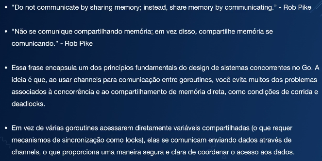


### Channels and their types

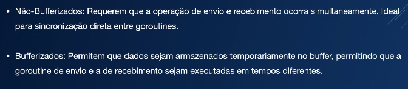

### Channel Internal

```golang
type hchan struct {
 qcount   uint           // total data in the queue
 dataqsiz uint           // size of the circular queue
 buf      unsafe.Pointer // points to an array of dataqsiz elements
 elemsize uint16
 closed   uint32
 elemtype *_type // element type
 sendx    uint   // send index
 recvx    uint   // receive index
 recvq    waitq  // list of recv waiters
 sendq    waitq  // list of send waiters

 // lock protects all fields in hchan, as well as several
 // fields in sudogs blocked on this channel.
 //
 // Do not change another G's status while holding this lock
 // (in particular, do not ready a G), as this can deadlock
 // with stack shrinking.
 lock mutex
}
```

### Channels Workflow

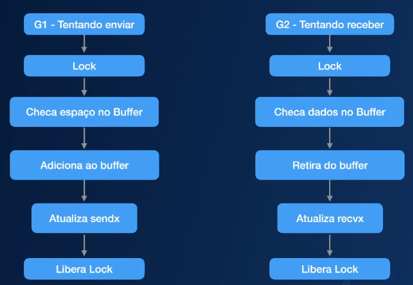

## Buffered Channels

<div>
  <p style="font-weight: 1000">
    High Thoroughput
  </p>
  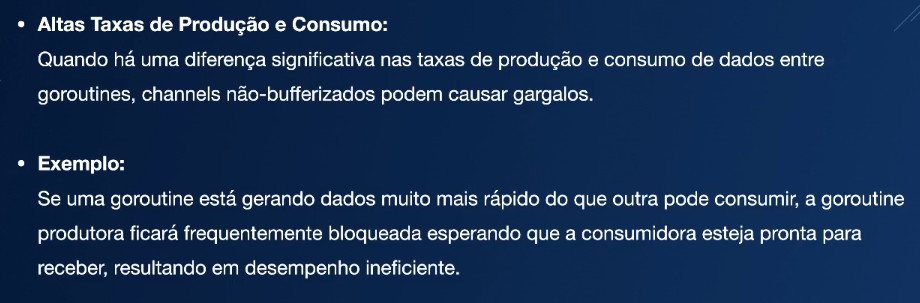

  <p style="font-weight: 1000">
    Data Pipeline
  </p>
  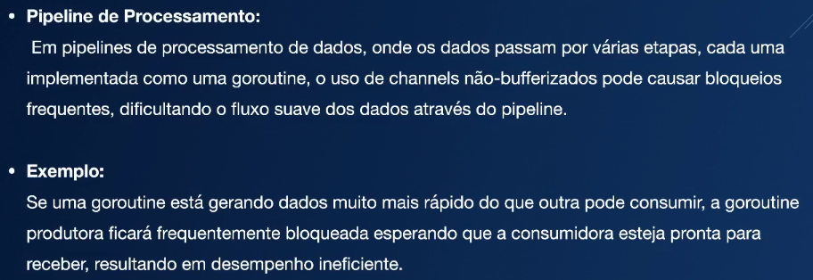

  <p style="font-weight: 1000">
    Async Operation
  </p>
  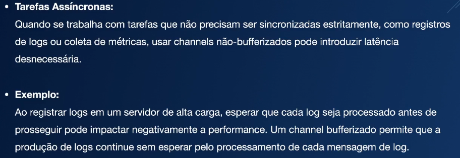

  <p style="font-weight: 1000">
    Multiple Groutines
  </p>
  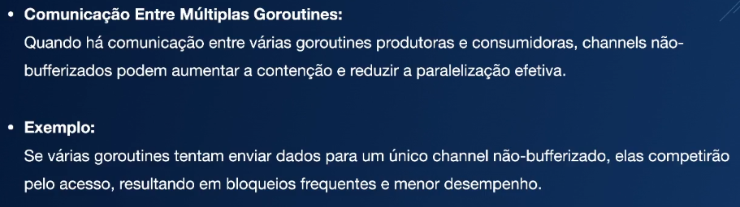

  <p style="font-weight: 1000">
    I/O
  </p>
  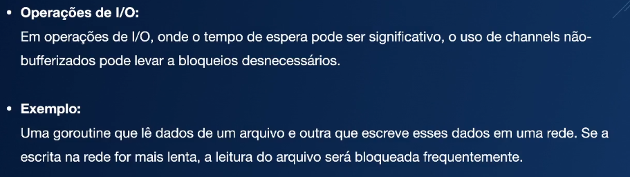

  <p style="font-weight: 1000">
    Summary
  </p>
  
</div>

## Non-Buffered Channels

<div>
  <p style="font-weight: 1000">
    Synchronous Operation
  </p>
  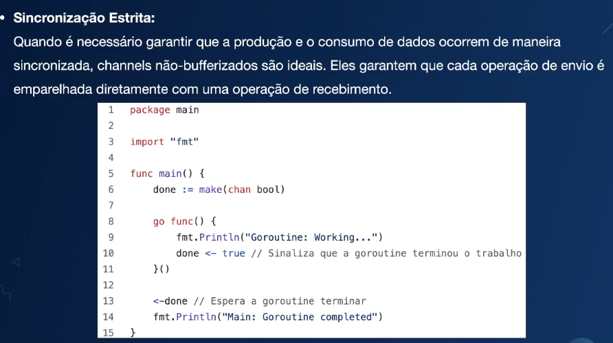

  <p style="font-weight: 1000">
    Handshake
  </p>
  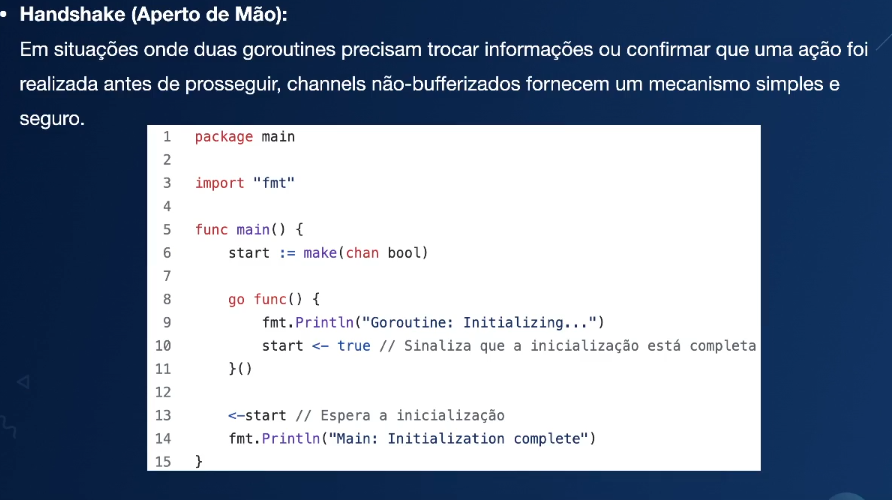

  <p style="font-weight: 1000">
    Timed Events
  </p>
  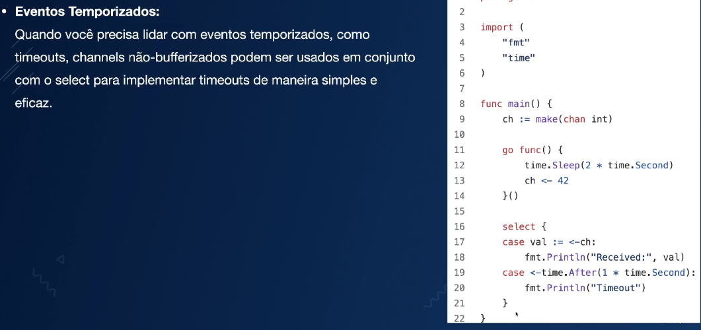

  <p style="font-weight: 1000">
    Workers
  </p>
  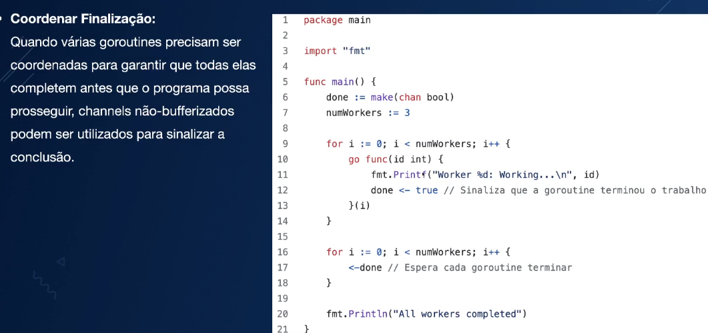
</div>

## Size of Buffer in Channels

- It depends on several factors:
  - Data processing and consumption
  - Requirements for latency and performance
  - Available memories
  - Specific needs of your pipeline for data processing

Lastly, must be monitored and adjusted accordingly, using load test and performance test during development to find ideal buffer size.

## Stack Management

- Well known data structure with LIFO (Last Int, First Out)
- Stores local variables and control flows, such as referenced address

- Local variables
- Function parameters
- Address of returning value
- Scope and lifetime of variables and/or objects

### Stack in Go

- Is segmented

  - Efficient memory management and performance (increase/decrease in size)
  - Initialize with 2kb
  - Runtime verifies necessity for additional space during goroutine execution
  - Copies previous stack and allocates to new stack segment with new pointer

- Decreasing in size

  - The runtime can free unused segments to decrease its size

- Guard Pages and Stackoverflow
  - Guard Pages is used to protect from access outside of stack limit, preventing segmentation faults
  - Verifies stack limit to not oversize, preventing stackoverflow

## Escape Analysis

- The Compiler decides if the object should go to stack or heap
- If the variable could out live function scope where it was created, then it's moved to the heap
- To see if variable was escaped, `run go build -gcflags="-m" main.go`

- Returns a pointer
  - If the function returns a pointer to a local variable, it is allocated to the heap, because pointer can be used outside of function's scope
- Storing in data structure
  - If the local variable is stored in data structure which outlives the scope of function, it is allocated in heap
- Goroutines
  - If the local variable is used inside goroutine, it is allocated in heap. Because goroutine can keep running after the function's return.

## Network Poller

### File Descriptor (FD)

- Identifier which OS uses to access files, sockets or other I/O resources
- FDs are integer value associated with I/O resources to run operations such as read, write and monitor events

- Types of FDs:

  - Files
  - Sockets
  - Pipes
  - Hardware

- Special FDs:
  - 0: stdin(standard input: keyboard)
  - 1: stdout(standard output: monitor)
  - 2: stderr(standard error: error message)

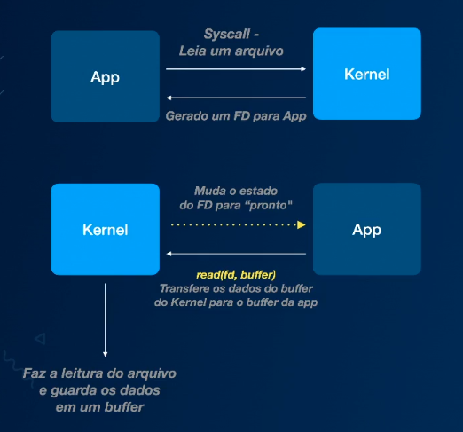

## File Descriptor Status

- Readbale: Ready to read. Data available to be read. (EPOLLIN)
- Writeable: Ready to receive data and write without blocking (EPOLLOUT)
- Error: Error in File Descriptor. Closed or invalid. Application needs to remove FD from poll. (EPOLLERR)
- Hang-up: The connection closed or hang-up unexpectedly in FD. (EPOLLHUP)
- Priority Read: High priority data are ready to be read. (EPOLLPRI)
- Edge-Triggered: Status update notification on FD. (EPOLLET)

## I/O Multiplexing

- Monitors multiple FDs simultaniously, looking for which FD is ready for input or output, without blocking the process.
- Allows a process to execute other tasks or stay ready until one or more FDs are ready to be processed.
- One process is able to monitor and interact with multiple I/O without needing multiple threads or processes.
- Prevents from process to get blocked while it waits for a FD, allowing it to deal with multiple FDs at the same time.
- Ideal for concurrent applications with several simultanious connections like network server and distributed systems.

## Types of I/O Multiplexing

- select and poll
- epoll (linux)
- kqueue (Mac/BSD)
- IOCP (Windows)

## Network Poller in Golang

- Responsible for monitoring and managing events from asynchronous I/O (read or write from network data)
- Non-blocking: Goroutine does not stop execution while it waits for the result.
  - Network Poller monitors readdines of operations
- The goroutine with I/O process can be suspended while the poller monitors - no CPU usage
- I/O Multiplexing

## Epoll in Linux with Golang

- An I/O Multiplexing mecanism introduced in Linux kernel
- Used to monitor multiple File Descriptors (FDs), allowing OS to notify programs when FDs are ready for read or write
- Allows the application to be notified, when FD is ready for I/O without consulting constantly (busy-waiting)
- Reduces CPU usage. Epoll can block until I/O event occurs, instead of polling all the time
- Supports high throughput of I/O in applications with thousands of simultanious connections
- Used in:
  - Networking (web servers)
  - Asynchronous service (messaging systems, data bases)
  - Low latency application (high efficiency to process I/O events)

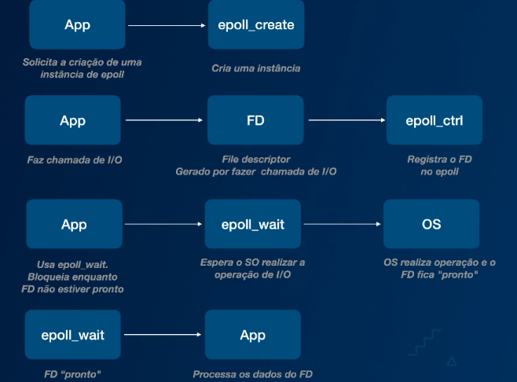
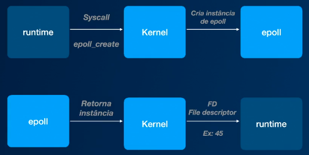

## Webserver Example

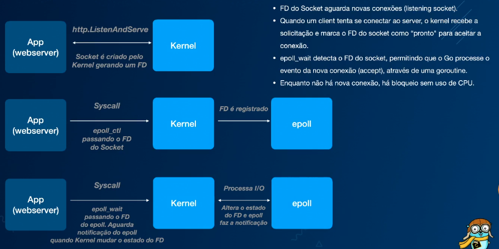
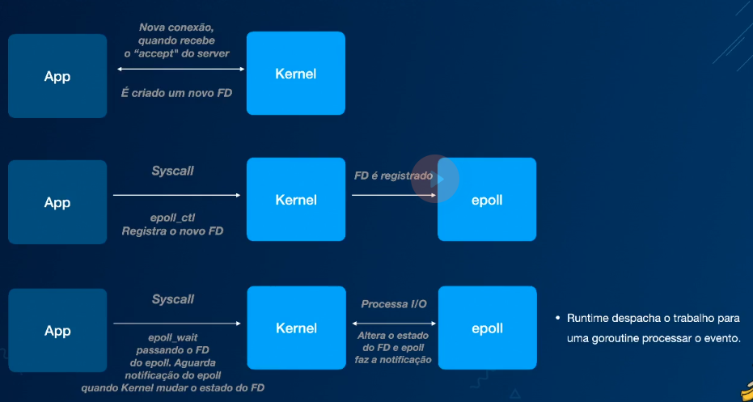
