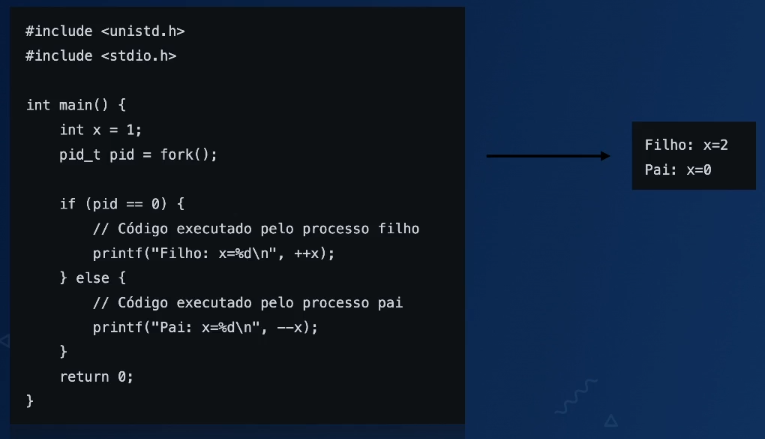

# Go Internals

## Multitask and its Timeline

- Before Multitask - (1940 - 1960)
- Time-Sharing System - (1960 - 1970)
- OS's Multitask - (1980)
- Hyper-Threading - (1990 - 2000)
- Multi-Core - (2000)
- Optimization for Cloud, AI and etc (2010)

## Processes

- An instance of a program in execution
- Components
  - Addressing (part in memory dedicated for a process)
  - Contexts
    - Datas and informations OS saves to manage processes
      - Ex.:Program Counter(PC) or Instruction Pointer(IP)
      - Have the address for next instruction processor will execute
      - Assist in Context Switching

## Process Register

- Area where datas and addresses are saved temporary in CPU to be executed
- Datas
  - Ex.: Arithmetic operations and logics
- Register Address
  - Memory allocation including stack pointers
  - Ex.: When accessing a variable, CPU has a registry of a memory to save its value

## Heap and Stack

[Heap and Stack as memory](https://medium.com/eureka-engineering/understanding-allocations-in-go-stack-heap-memory-9a2631b5035d)

- Heap

  - Dynamic memory allocation at runtime

- Stack

  - Used for storing local variables, function arguments, and return addresses during function calls. (LIFO)

## Status and Flags in Registers

- Gives recent status from operations executed by CPU
- Uses specific bits (flags)
- Ex.:
  - Flag Zero (Z): Result of the operation which returned 0.
  - Flag Signal (S) or Negative(N): Indicates whether the result of operation is positive or negative
  - Flag Overflow: Overcapacity in produced result

## Lifecycle of a process

- Creation

  - UNIX/Linux uses fork() to create new process when a program requests for process execution

- Execution

  - The process is being executed by CPU. Can be "executing" or "ready"

- Waiting/Blocked
  - The process is suspended until external event finishes. Common in I/O, where process waits for disc reading or waits for networkd input
- Termination
  - The process completes it execution or terminated forcefuly
  - Exit: Success after concluding instructions
  - Killed: Interruption by error execution or terminated by other process (such as command "kill")

## Creating Process

- UNIX/Linux

  - fork()
  - Clones current process
  - Creates a child process
  - fork() returns diffent value to the parent process (PID)
  - Parent and child processes are identical. However, the values in memory are copied to the different address, separate and independent

    

## Managing Process

- Scheduler
  - Decides which processe will be executed
  - Alternate between processes
  - Has several algorithms in attempt to maximize CPU use
  - It selects processes from queue with "ready queue"
  - Allocates CPU: Switch states, Ready to Running
  - Frees CPU: I/O when not needed
- Types of Schedulers
  - Non-preemptive: The process in execution has control on when to free CPU for other process. It has a drawback of one process using CPU exclusively.
  - Preemptive: The OS is capable to interrupt a process in execution and give CPU different process. It operates "fairly". Lots of "Context Switching".

## Threads

[Program vs Process vs Thread](https://bytebytego.com/guides/what-is-the-difference-between-process-and-thread/)

- **Program** is an executable file containing a set of instructions. One program can have multiple processes.
- **Process** is an instance of program in execution. When a program is loaded into the memory and becomes active, the program becomes a process.
- **Thread** is the smallest unit of execution within a process.

## Memory in Threads

- Thread uses less memory than process.
- Each thread has own stack independently and isolated.
- Each thread (OS) uses 2MB. (Golang thread uses 2kb)
