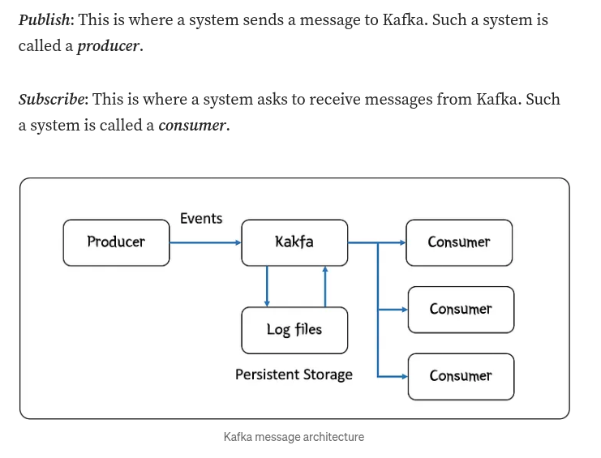
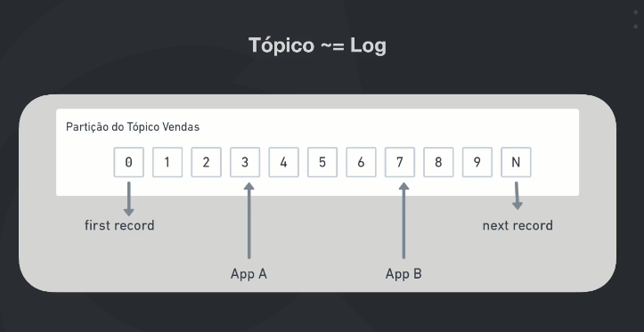
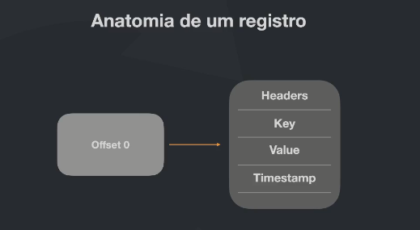
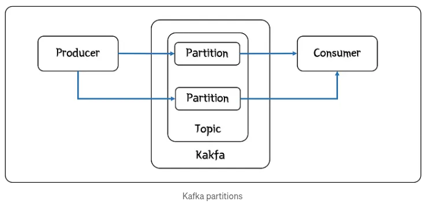
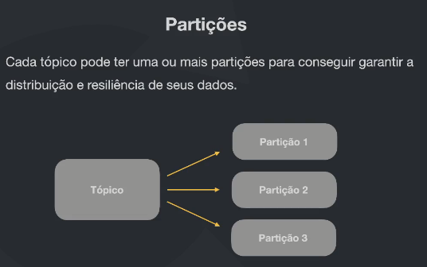
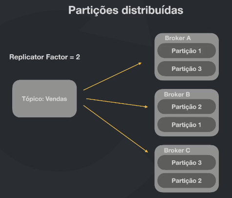
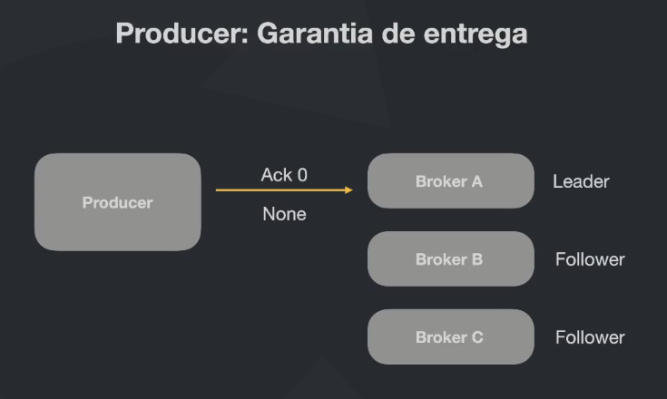

# Apache Kafka

## What is Apache Kafka

Apache Kafka is first introduced by Linkedin, when they had to scale their platform to microservices. Today, Kafka is open-source publish/subscribe queue (pub-sub) solution, widely used in software development industry.

Producer publishes messages to Kafka. Kafka stores these messages as commit log files in its filesystem. Any number of consumers can then subscribe to receive these messages.

Unlike other queueing technologies, messages are persistent and are not deleted once read. This allows consumers to read all the previous messages, which helps recovering from failures.

## Topics

Events and messages are organized and durably stored in Topics. We can understand Topics as a folder in a filesystem, and the events are the files in that folder.

Each event registered inside a topic is called "offset", from first record to Nth record. Consumers are able to read these offsets simultaniously.

Each offset has a data structure as shown in the figure below.

- Headers
- Key
- Value (JSON)
- Timestamp

## Partitions

A topic is subdivided into Partitions. This enables event messages to be read and stored in distributed setting, giving much more resiliency and throughput.

Distributed setting is configured by Replicator Factor. Each broker can be configured replicator factor to make brokers contain numbers of partitions necessary to guarantee resiliency.

### Partition Leader

Each partition has one server which acts as the “leader” and zero or more servers which act as “followers”. The leader handles all read and write requests for the partition while the followers passively replicate the leader. If the leader fails, one of the followers will automatically become the new leader. Each server acts as a leader for some of its partitions and a follower for others so load is well balanced within the cluster.

    
    

    

## Delivery Guarantees

- Fire and forget:
  - Ack 0 or None
  - This delivery method is risky because producer sends a message, but doesn't wait for Kafka confirmation.
  - At the same time, this can speed up message processing time without waiting for delivery confirmation.

- Send to Leader:
  - Ack 1
  - This time Ack 1 sends messages to the Leader, the broker confirms delivery and notify producer. - There is still a risk, for example, broker somehow shutsdown and there was no time to replicate messages to the followers. In this scenario, messages are lost.

- Send to Leader and replicate immediately to the followers:
  - Ack -1 or All
  - Broker receives messages, saves them, then replicate them immediately to the followers, guarantees complete delivery.
  - Much slower.

