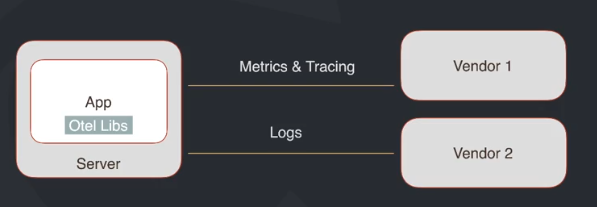
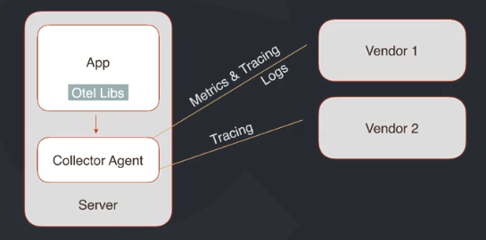
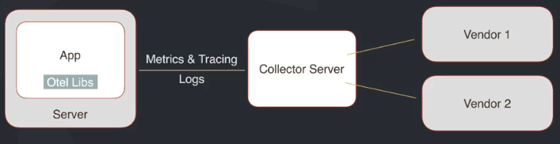

# OpenTelemetry

OpenTelemetry is an observability framework and toolkit designed to facilitate the

- Generation
- Export
- Collection

of telemetry data, such as logs, tracings and metrics.

Open source and vendor, tool-agnostic.

# Observability

Observability is the abillity to understanda the internal state of the system by examining its outputs.
To make system observable, it must be instrumented. The code must emit logs, traces and metrics.
Then instrumented data must be sent to observability backend.

## Observability vs Monitoring

- **Observability**
  - It shows why is it happening.
  - Why CPU and memory is reaching machine's limit?
- **Monitoring**
  - It shows what is happening in the system (e.g., alerts to monitor problems).
  - Ex.: CPU and memory usage is almost at its limit.

## 3 Pillars of Observability

- **Metrics**
  - How many? (request rates, CPU usage, memory consumption, error rates)
  - Broad view of system's health.
  - Quantitative data that measures performance and resource utilization.
- **Logs**
  - Something registered in the past (events, service executed, request with error, etc)
  - Detailed chronological records.
  - What happened within the system?
- **Traces**
  - Records thar track the flow of a request from the frontend to the backend through various components of a system. It helps understanding the path and performance of requests, identifying bottlenecks, and latency issues. (Must have in microservices)

## Open Telemetry Components

### Specification

- Cross-language requirements and expectations for all implementation.

It defines:

- SDKs
- APIs
- Data

### Collector

- Vendor-agnostic proxy to receive, process and export telemtry data.
- The data is refined, standardized, enriched, tagged, and then exported to observability platform.

### Libs

- A library ecosystem that implements instrumentation for common libraries and frameworks.

## Architecture

**Without Collector**

**Collector as Sidecar (Collector Agent)**

Host application and collector agent inside same pod

**Collector as own server**

Application and collector are on their own pod

