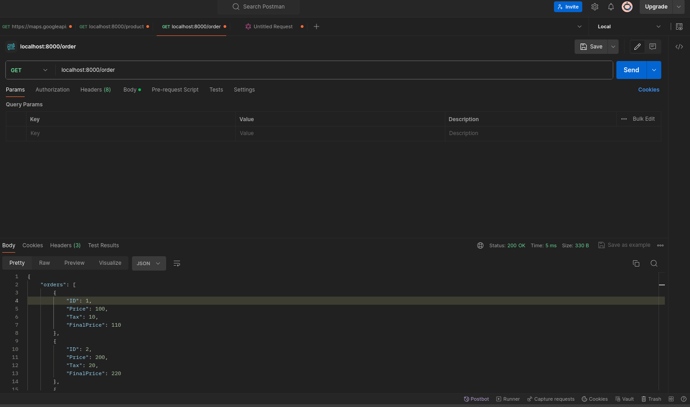
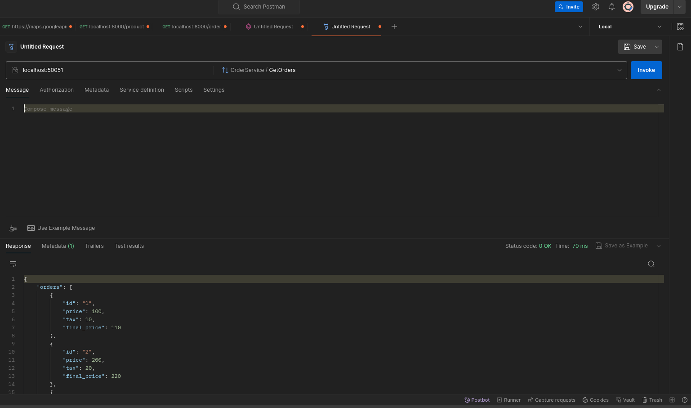
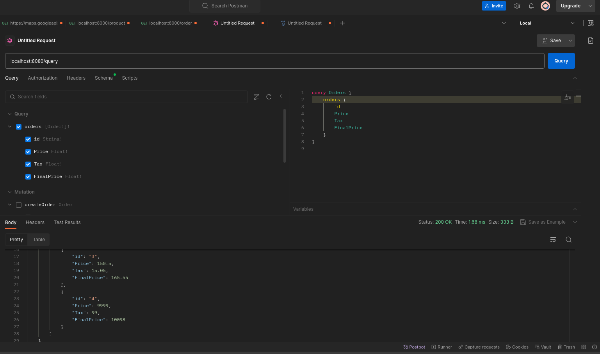

# Clean Architecture

In this project, you must implement usecase for listing orders.

# Requirements

This listing must be implemented in REST, GraphQL and gRPC.

- Endpoint REST (GET /order)
- Service ListOrders with gRPC
- Query ListOrders with GraphQL

Must include, migrations and api.http for testing.

Use Docker for database creation and connection.

# Testing

- Run `docker compose up -d` to start up database container with seeds.
- I used Postman for testing purpose:

### REST API

- GET localhost:8000/order
- POST localhost:8000/order

### gRPC

- localhost:50051
- OrderService
  - CreateOrder
  - GetOrders

### GraphQL

- localhost:8080/query

- Query

  - orders

- Mutation
  - createOrder

