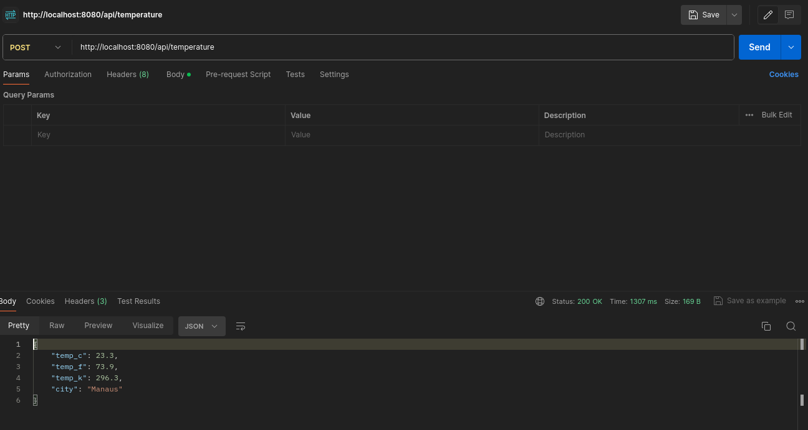
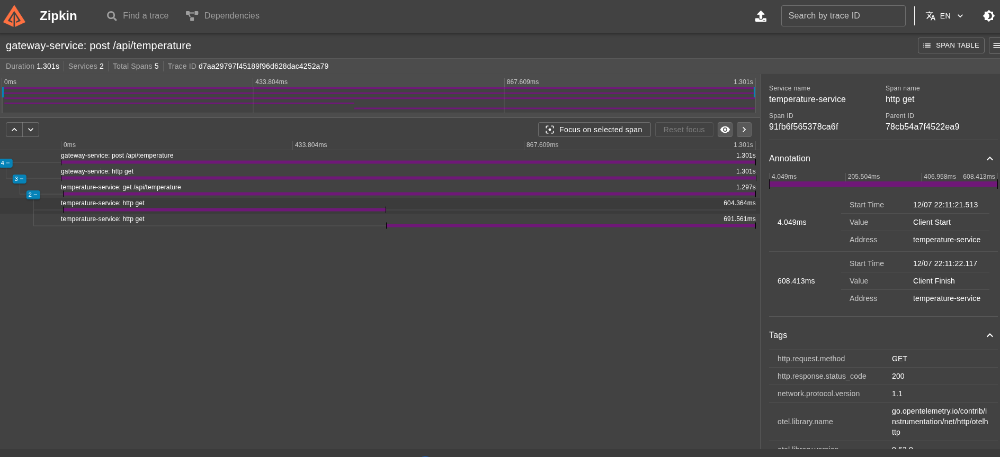

# OpenTelemetry Temperature Services

## Goal

Develop a system in Golang to receive CEP (zip code), identifies the city and returns current temperature and requested city. Must be implemented OpenTelemetry instrumentation and Zipkin for **observability**.

There are two services:

- Service A

  - Responsible for receiving input with 8 digits zip code as POST request.
  - Must validate valid input with **8 digits** and **isString**.
  - Then send send zip code to Service B as HTTP.

- Service B
  - Must receive valid zip code.
  - Search location using valid zip code and return its temperature with city name.

## Observability

- Must implement distributed tracing between Service A and Service B.
- Use span to measure response time of external services CEP and Weather.

- Use:
  - OTEL
  - Zipkin

## How to Test

**_Run containers_**

```sh
$ docker compose up --build -d
```

**_*Execute endpoint `http://localhost:8080/api/temperature`*_**

**_Example:_**



**_Check Zipkin for traces between services in `http://localhost:9411`_**


