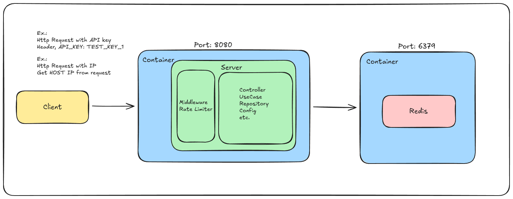

# Rate Limiter by IP and Token

## Objective

Develop a rate limiter in Go that can be configured to limit the maximum number of requests per second based on:

- A specific IP address:

  Restrict number of requests per IP address by predefined set of interval.

- A specific access token:

  Restrict access by access token, allowing different expiration time in each token. The token should be added in header as API_KEY: [TOKEN]

The rate limit using access token has priority higher than of IP restriction. If the IP limit has 10 req/s and the access token has a limit of 100 req/s, the access token limit should be utilized.

## Requirements

- The Rate Limiter must be implemented as a middleware
- Must be configurable the maximum requests allowed per second
- Must be configurable the block duration after reaching allowed requests per second
- The configuration must be set in .env file in root
- Once the limit is reached, system must return adequate response;

  Status code: 429 (Too Many Requests)
  Message: "you have reached the maximum number of request or actions allowed within a certain time frame"

- Every limiter information must ve stored in Redis using docker compose
- Create a strategy to allow switching Redis for other persistence method
- The logic for Rate Limit must be separated from middleware

# Rate Limiter



## Full API Test Flow

**Start Containers**

Run `docker compose up -d` to start server and redis.

**Verify RateLimiter Configuration**

The .env file has configuration for container mapping and API Key/IP allowed max request, window and block duration for each key.
You'd have to update API_KEYS to add new allowed key and add new
`[API_KEY_NEW_KEY_NAME_CONFIG_FOR_RATELIMITER]` for newly configured API Key.

**Testing**

There are two test types, unit test and stress test.

Run `go test ./...` to run all of them.

Run `go test ./internal/stress_test -v` to run only stress test.

Use `http://localhost:8080/api/health` to execute endpoint manually, setting API_KEY header with allowed API Key in .env file.

```
Example:

curl -i \
  -H "API_KEY: TEST_KEY_1" \
  http://localhost:8080/api/health

```
