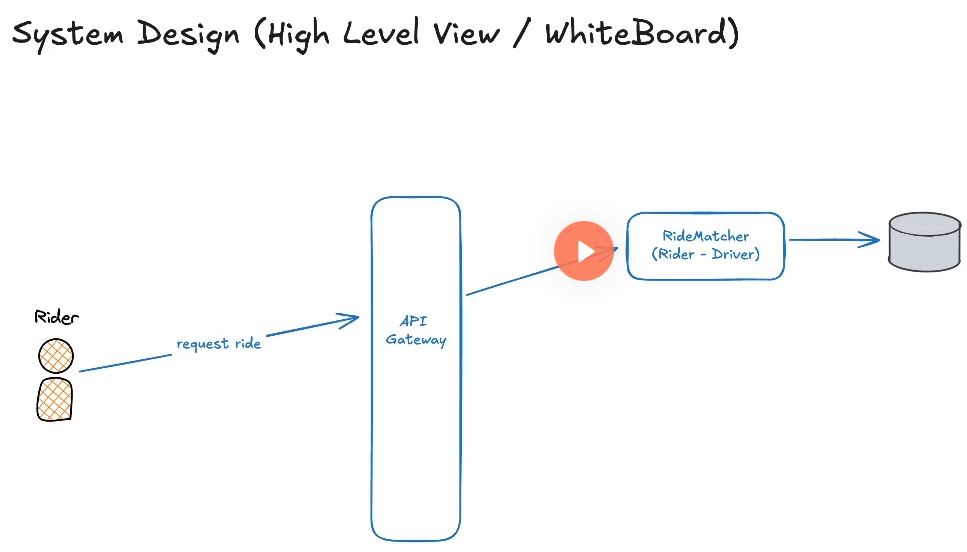

# System Design Requirements

- Functional Requirements
  - System's utilities
  - Features
  - Example from Uber -> User requests for a car ride choosing a location and a destination
- Non-Functional Requirements
  - Low latency
  - Availability
  - Availability vs Consistency
  - Security
  - Data governance

# Capacity Planning

- Active Users
- Temporary high-usage
- Write Intensive vs Read Intensive
- Average traffic per user
- Storage (How many TB in a year, 5 years, etc)

# Core Entities

- Noun
- Example from Uber -> User, Car Ride, Location
  - They all have IDs

# API Design

- Resource oriented
  POST /ride/request/(maybe some token with id)

```
{
  rider_location,
  destination
}
```


